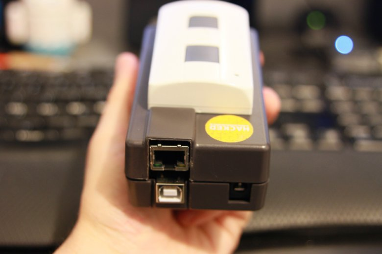
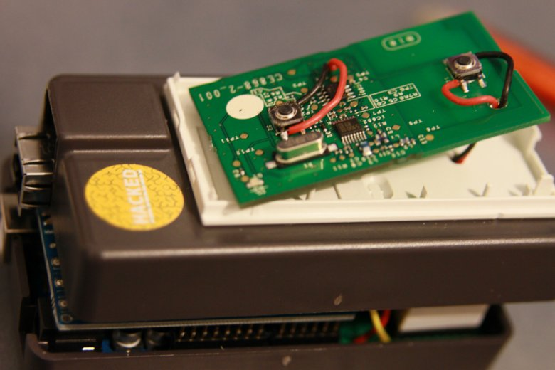
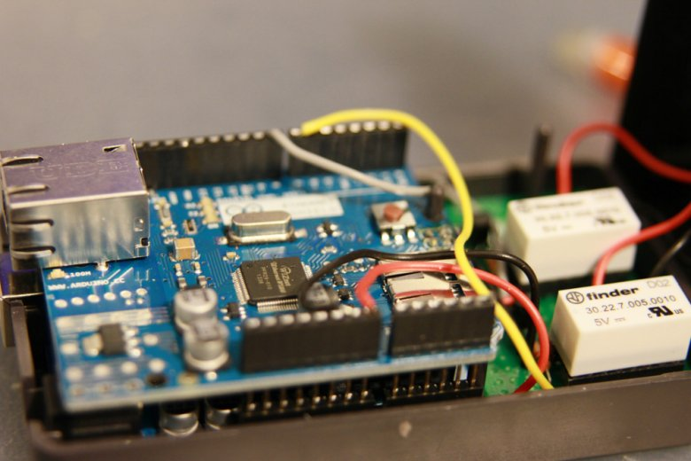

# iBubbendorff

This **arduino app** allows you to transform a proprietary **Bubbendorff** remote control into a connected object that allows you to control your shutters remotely with your phone.

You can open and close your shutters using these requests  : 
* GET http://ip-of-arduino/down
* GET http://ip-of-arduino/up

My french post of this project : http://www.geeek.org/comment-domotiser-ses-volets-radio-pour-moins-de-50-960.html

Electronic schema : 2 relay are connected to the Bubbendorf remote control.

